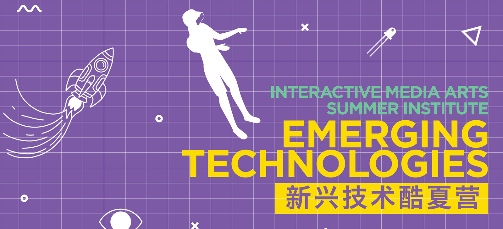

  

# Creative Coding | Emerging Technologies | IMA Summer Institute '26 at NYU Shanghai

## Course Information

- Instructor: [J.H. Moon](mailto:jh.moon@nyu.edu)
- Classroom: N304 (Inside of IMA Studio)

## Course Schedule & Materials

*The course schedule may be subject to change. Changes will be communicated in class.*

Week 1
- Class 1: Draw Your Imaginary Self
  - Introduction to the Course (Slides, PDF)
  - Introduction to p5.js (Slides, PDF)
  - Colors (Slides, PDF)

- Class 2: Make It Move (Slides, PDF)

Week 2
- Class 3: Build Patterns and Systems (Slides, PDF)
- Class 4: Create Your Interactive Experience (Slides, PDF)

Bonus:
- Particles
- Images
- Sound Synthesis

### Description

Creative Coding introduces students to the fundamentals of programming through playful and hands-on creative projects. Using [p5.js](https://p5js.org/), a JavaScript library for creative coding, students will explore how programming can become a creative tool for drawing, animation, interaction, generative patterns, unconventional interactive experiences, and digital narratives.

This summer camp course is designed for students with no prior programming experience. Rather than covering every programming concept in depth, the course offers an accessible first experience with code as a creative material. Students will work with shapes, colors, motion, images, sound, and simple generative systems to create visual and interactive works on the web.

Each class focuses on a small creative outcome, such as drawing an imaginary self, adding motion and behavior, building generative patterns, and combining these elements into a final interactive experience. Through these activities, students will not only learn technical skills but also experiment with how programming can support imagination, self-expression, visual thinking, playful systems, and unique interactive experiences.

### Overview and Learning Outcomes

Creative Coding is organized as a four-class summer camp. Each class introduces a focused set of creative coding concepts through short demonstrations, examples, and hands-on activities. Students will also have access to extensive example sketches, allowing them to review, modify, and continue experimenting outside of class.

Throughout the course, students will engage foundational programming concepts and computational processes, such as variables, conditionals, randomness, repetition, and transformations. These concepts will be connected to creative outcomes, including generative visuals, motion, interaction, and simple computational systems.

Upon completion of this summer course, students will be able to read and modify basic p5.js sketches, break creative ideas into smaller computational steps, experiment with variation, and combine multiple coding concepts and techniques into generative visualizations and interactive experiences.